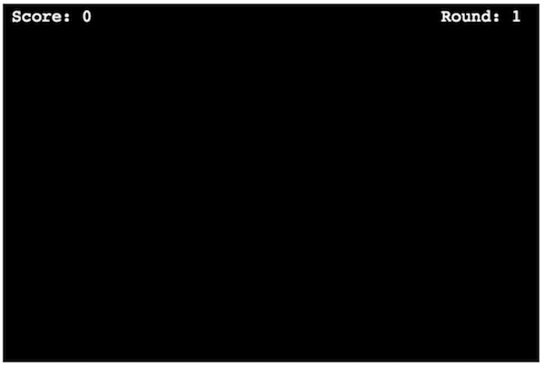
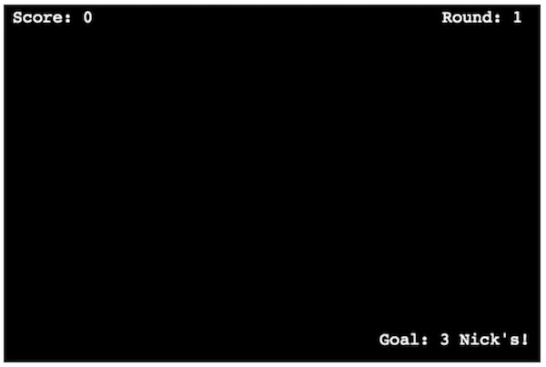
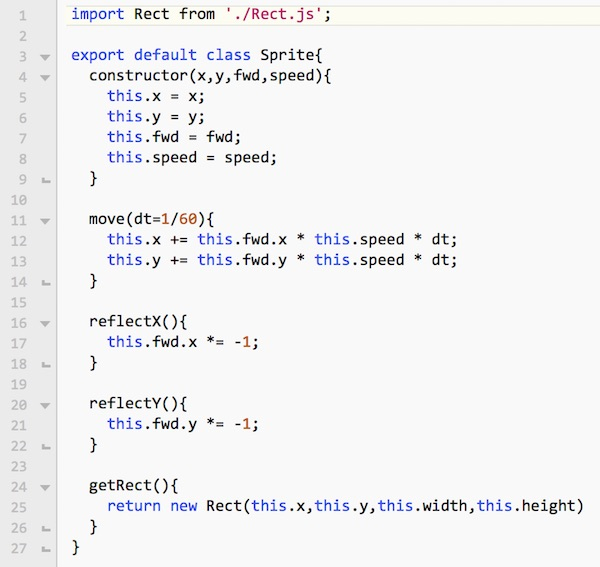
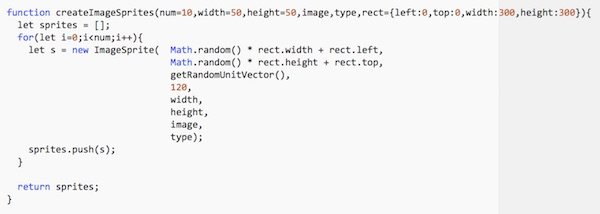

# HW - *Cage Clicker* Part II

Let's dive right in!

## I. Drawing the HUD for the main screen

Let's start by drawing the HUD (score, level, etc) for the main screen:

1. Add the following to `case GameState.MAIN` in `drawHUD()`:

```js
fillText(ctx,`Score: ${levelScore}`, 10, 20, "14pt courier", "white");
fillText(ctx,`Round: ${currentLevel}`, screenWidth - 110, 20, "14pt courier", "white");
```

- Note: above we are using [ES6 Template Literals](https://developer.mozilla.org/en-US/docs/Web/JavaScript/Reference/Template_literals), rather than string contatenation, to create the score and round strings.

**Reload the page, click on the start screen, the main screen should load and look like this:**




2. Here's another part of the HUD - the "goal" - i.e. the number of "cages" we need to click on to get through a level.

```js
fillText(ctx,`Goal: ${levelGoal} Nick's!`, screenWidth-180, screenHeight-20, "14pt courier", "white");
```

- When you reload the page you will get an error and not see the text - because `levelGoal` was never declared - go ahead and do so near the top of *main.js* - like you did with those other module variables in chapter 1. If you don't give it a value, the HUD will say it's `undefined`, biut that's OK because we are going to give it a value (depending on the `currentLevel`) next.

## II. Implementing `loadLevel()`

- Next up is implementing `loadLevel()`.
- Recall that `loadLevel()` is getting called in `doMousedown()` whenever we click the mouse on the start screen
- Currently  `loadLevel()` is an empty stub, let's go add some code now!

1. Add the following to `loadLevel()`:

```js
switch(currentLevel){
		case 1:
		// 3 Nick Cage's, 5 others
		/*
		sprites = sprites.concat(	
			createImageSprites(3,50,60,imageData.cage1,"cage",rect),
			createImageSprites(5,60,45,imageData.tommy1,"tommy",rect)
		);
		*/
		levelGoal = 3;
		levelTarget = "cage";
		vectorChangeProb = .005;
		levelTimeLimit = 5;
		break;
				
		default:
		throw new Error(MyErrors.loadLevelSwitch);
} // end switch
```
- Note that we are deliberately commenting out the calls to `createImageSprites()` for now
- When you reload the page, error! There are more variables you need to declare!

2. As before, declare `levelTarget`, `vectorChangeProb` and `levelTimeLimit` at the top of *main.js* - we will be using these variables soon!

**To verify that our level data has been loaded, reload the page, you should now see a "Goal" of 3 displayed in the bottom right corner:**




## III. Creating our Sprite classes

We actually have 3 sprite classes that need to be implemented:

- `Rect` - has `.x`, `.y`, `.width`, and `.height` fields
- `Sprite` - inherits from `Rect` - adds `move()`, `reflectX()`, and `reflectY()` methods
- `ImageSprite` - inherits from `Sprite` - adds a `draw()` method - so we can actually see it on the screen

1. The base class for our sprite objects (e.g. the Cage, Tommy, Garofolo, and Franco sprites) is going to be named `Rect` and contained in a new file named **Rect.js**, it looks like this:

**src/Rect.js**
```js
export default class Rect {
  constructor(x,y,width,height) {
  	this.x = x;
  	this.y = y;
  	this.width = width;
    this.height = height;
  }
  
  // http://24bitjs.com/2014-11-how-to-detect-if-a-point-is-inside-a-rectangle-in-javascript/
	containsPoint(point) {
		if (this.width <= 0 || this.height <= 0) return false;
		return (point.x >= this.x && point.x <= this.x + this.width && point.y >= this.y && point.y <= this.y + this.height);
	}
  
}
```

2. Next, here is our `Sprite` class that inherits from `Rect` - we are going to give you the pleasure of typing it in:

**src/Sprite.js**




3. Lastly, this is our `ImageSprite` class that inherits from `Sprite` - we are going to give you the pleasure of typing it in:

**src/ImageSprite.js**


4. And now we need to implement our helper method that will create instance of Sprite for us. Add the following to *helpers.js*:



5. - **IMPORTANT:** Be sure to write code in *helpers.js* that will `import` the `ImageSprite` class from `ImageSprite.js`


## IV. Using our ImageSprite class

1. In *main.js* go ahead and uncomment the code that calls our helper method, creates the sprites and adds them to the `sprites` array

- Reload the page. You should get an error - **`Uncaught ReferenceError: createImageSprites is not defined`**

2. Oops, we forgot to **export** `createImageSprites()`:
  - head back to *helpers.js* and do that now
  - you will also need to **import** `createImageSprites()` at the top of *main.js*

<hr><hr>

**[Previous Chapter <- Cage Clicker Part I](HW-cage-clicker-1.md)**

**Next Chapter -> Cage Clicker Part III**
