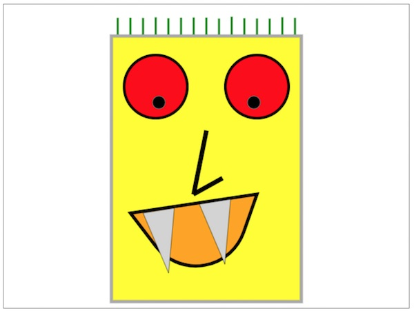

# HW - Canvas Helper Functions

## I. Overview & Requirements
- In this assignment you will begin to build a library of canvas "helper" functions, and then test them by creating a simple procedural work of art. These functions will come in very handy once you begin to work on the Audio Visualizer project.
- In the starter code below, we have implemented `drawRectangle(ctx,x=0,y=0,width=25,height=25,fillStyle="red",strokeStyle="black",lineWidth=0)` for you, and added two tests of the function, one of which uses default arguments, the other uses all of the available parameters
- Requirements:
  - complete the implementation of these stubbed methods (see below): `drawCircle()`, `drawLine()`, `drawTriangle()` and `drawArc()`. The function signatures are all done for you, you just have to write the code that goes inside the functions
  - artwork requirements:
    - use each of the 5 functions at least once, and you must draw at least a dozen distinct shappes on the screen
    - use a `for` loop (or other iterative construct) at least once to create multiple shapes (see the "hair" in the example below)
    - use all three canvas transformations (`ctx.translate()`, `ctx.rotate()`, `ctx.scale()`) at least one time. Don't forget to `ctx.save()` before you use the transformations, and `ctx.restore()` when you are done.
    - the art work must have a coherent theme, and not simply be a random jumble of shapes
    - the doesn't necessarily need to be "beautiful" - the crude example below is sufficient, although we certainly hope you can do better. Example themes include: abstract geometric shapes arranged in a pleasing manner ([Mondrian](https://en.wikipedia.org/wiki/Piet_Mondrian) for example or something like this [Vector work](https://www.123rf.com/photo_85367242_stock-vector-vector-minimal-covers-procedural-design-futuristic-minimalistic-layout-conceptual-generative-backgro.html)) or just google "simple procedural art" for ideas, a forest scene, a snowy field, an ocean, 2 or 3 houses, simple figures or animals, cars, etc
- Hints:
  - your recent lecture notes should come in very handy for this
  - feel free to add parameters to these functions if you wish - for example, adding a `lineCap` parameter to `drawTriangle()`
  - feel free to create additional helper functions

## II. Start Code

**canvas-helpers-start.html**
```html
<!DOCTYPE html>
<html lang="en">
<head>
	<meta charset="utf-8" />
	<title>Canvas Helpers Starter</title>
	<style type="text/css">
	canvas{
		border:1px solid gray;
	}
	</style>
</head>
<body>
	<canvas width="640" height="480">
		Get a real browser!
	</canvas>
	<script>
	'use strict';
		
	init();
	
	function init(){
		let ctx = document.querySelector('canvas').getContext('2d');
		// test the drawRectangle() function
		drawRectangle(ctx);
		drawRectangle(ctx,100,100,250,250,"red","yellow",10);
	}
	
	// we took care of drawRectangle() for you - now you need to complete the other 4 functions
	function drawRectangle(ctx,x=0,y=0,width=25,height=25,fillStyle="red",strokeStyle="black",lineWidth=0){
		ctx.save();                
		ctx.beginPath();            
		ctx.rect(x,y,width,height);   
		ctx.closePath(); 
		ctx.fillStyle = fillStyle;
		ctx.strokeStyle = strokeStyle;    
		ctx.lineWidth = lineWidth;  
		ctx.fill();              
		ctx.stroke();                            
		ctx.restore();             
	}
	
	function drawCircle(ctx,x=0,y=0,radius=10, fillStyle="red",strokeStyle="black",lineWidth=0,startAngle=0,endAngle=Math.PI*2){
		// you do!
	}
	
	function drawLine(ctx,x1=0,y1=0,x2=100,y2=0,strokeStyle="black",lineWidth=5){
		// you do!
	}
	
	function drawTriangle(ctx,x1=0,y1=0,x2=50,y2=50,x3=-50,y3=50,fillStyle="red",strokeStyle="black",lineWidth=5){
		// you do!
	}
	
	function drawArc(ctx,x1=0,y1=0,x2=300,y2=0,cpX=150,cpY=75,fillStyle="red",strokeStyle="black",lineWidth=5){
		// you do!
	}
	
	</script>
</body>
</html>
```


## III. Example

Here's an example that meets requirements (you can definitely come up with something better):
- The head is made with `drawRectangle()`
- The eyes and pupils are made with `drawCircle()`
- The hair is made with `drawLine()` and a `for` loop, with a little `Math.random()` to slightly vary the length of the strands
- The nose is done with two `drawLine()` calls
- The mouth is done with `drawArc()`
- The teeth are done with `drawTriangle()` and here we used `ctx.translate()` / `ctx.rotate()` / `ctx.scale()` to make it MUCH easier to position the teeth




## IV. Rubric
- Work 2 HW assignments
