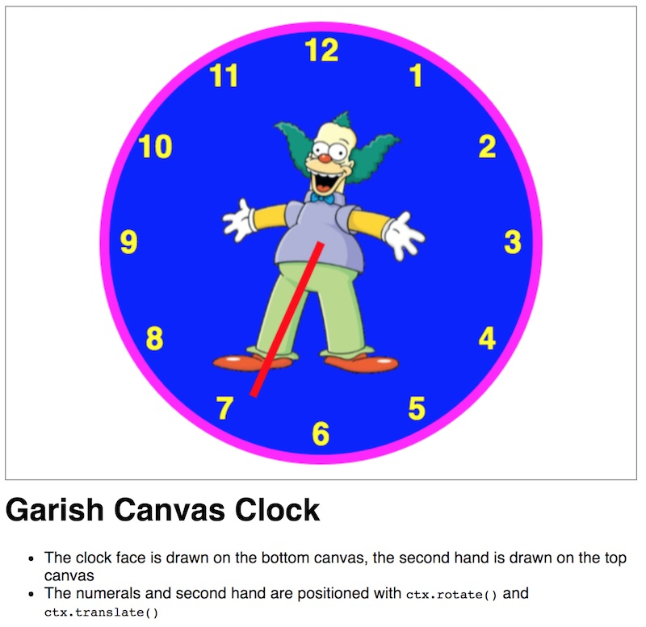

# Intro to the Canvas 2D Drawing API

The Canvas API provides a means for drawing graphics via JavaScript and the HTML &lt;canvas> element. You should have already looked over this presentation:
- [Intro-to-Canvas.pdf](../presentations/Intro-to-Canvas.pdf)

## I. Demo!
- Start file for today's "screen saver" demo is below
- Concepts covered:
  - Getting a reference to the 2D drawing context with `canvas.getContext('2d')`
  - setting context "state" attributes like `.fillStyle`, `.strokeStyle`, `.lineWidth` and `.globalAlpha`
  - drawing rectangles, circles and lines
  - creating paths, and stroking and filling them
  - setting up an animation loop
  
  
## II. Start File

**first-canvas.html**

```html
<!DOCTYPE html>
<html lang="en">
<head>
	<meta charset="utf-8" />
	<title>First Canvas</title>
	<style type="text/css">
	canvas{
		border:1px solid gray;
	}
	</style>
	<script>
		// #0 - in this class we will always use ECMAScript 5's "strict" mode
		// See what 'use strict' does here:
		// https://developer.mozilla.org/en-US/docs/Web/JavaScript/Reference/Functions_and_function_scope/Strict_mode
		'use strict';
		
		// #1 call the `init` function after the pages loads
		window.onload = init;
	
		function init(){
			console.log("page loaded!");
			// #2 Now that the page has loaded, start drawing!
			
			// A - `canvas` variable points at <canvas> tag
			let canvas = document.querySelector('canvas');
			
			// B - the `ctx` variable points at a "2D drawing context"
			let ctx = canvas.getContext('2d');
			
			// C - all fill operations are now in red
			ctx.fillStyle = 'red'; 
			
			// D - fill a rectangle with the current fill color
			ctx.fillRect(20,20,600,440); 
		}
	</script>
</head>
<body>
	<canvas width="640" height="480">
		Get a real browser!
	</canvas>
</body>
</html>
```

**Which gives us:**



### II-A. Handy Helper Functions

These will be useful as we build our screen saver.
```js
 // handy helper functions!
    function getRandomColor(){
      function getByte(){
        return 55 + Math.round(Math.random() * 200);
      }
      return "rgba(" + getByte() + "," + getByte() + "," + getByte() + ",.8)";
    }

    function getRandomInt(min, max) {
      return Math.floor(Math.random() * (max - min + 1)) + min;
    }
 ```
 
- BTW: what is the *scope* of the `getByte()` function above? Is it visible outside of the `getRandomColor()` function?
- and if we have time, we might re-factor `getRandomColor()` into something a little more "ES6ish" - for example:
  - replace `getByte()` with an [arrow function](https://developer.mozilla.org/en-US/docs/Web/JavaScript/Reference/Functions/Arrow_functions)
  - replace the string concatenation in the return statement above with [string template literals](https://developer.mozilla.org/en-US/docs/Web/JavaScript/Reference/Template_literals)
  
## III. Completed versions

We will demo how to draw a variety of shapes in class. Below are a couple possibile outcomes:


## IV. Homework
Do ONE of the following:

- Modify the above "screen saver" in some significant ways (so that it draws differently/looks different)

**OR**

- Create a "random walker" by following the instructions here --> [Random Walker HW](./HW-random-walker.md)

See mycourses dropbox for submission instructions

  
