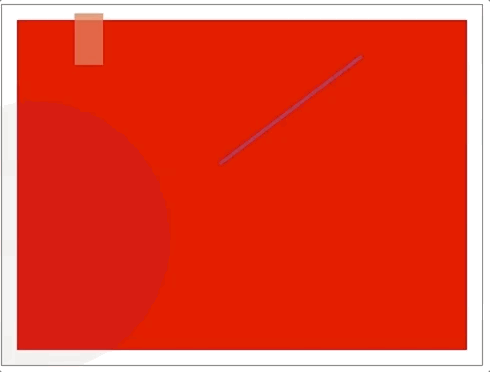

# Intro to the Canvas 2D Drawing API

The Canvas API provides a means for drawing graphics via JavaScript and the HTML &lt;canvas> element. You should have already looked over this presentation:
- [Intro-to-Canvas.pdf](../presentations/Intro-to-Canvas.pdf)

## I. Demo!
- Start file for today's "screen saver" demo is here -> [first-canvas.md](_files/first-canvas.md)
- Concepts covered:
  - Getting a reference to the 2D drawing context with `canvas.getContext('2d')`
  - setting context "state" attributes like `.fillStyle`, `.strokeStyle`, `.lineWidth` and `.globalAlpha`
  - drawing rectangles, circles and lines
  - creating paths, and stroking and filling them
  - setting up an animation loop
- and here are some handy helper functions we will be using today, they are provided below for your copy and paste pleasure:

```js
function getRandomColor(){
  function getByte(){
    return 55 + Math.round(Math.random() * 200);
  }
  return "rgba(" + getByte() + "," + getByte() + "," + getByte() + ",.8)";
}

function getRandomInt(min, max) {
  return Math.floor(Math.random() * (max - min + 1)) + min;
}
```

- BTW: what is the *scope* of the `getByte()` function below? Is it visible outside of the `getRandomColor()` function?
- and if we have time, we might re-factor `getRandomColor()` into something a little more "ES6ish" - for example:
  - replace `getByte()` with an [arrow function](https://developer.mozilla.org/en-US/docs/Web/JavaScript/Reference/Functions/Arrow_functions)
  - replace the string concatenation in the return statement above with [string template literals](https://developer.mozilla.org/en-US/docs/Web/JavaScript/Reference/Template_literals)
  
## VII. Completed versions

Here are a couple of possibilities:



  
## VI. Randomness
