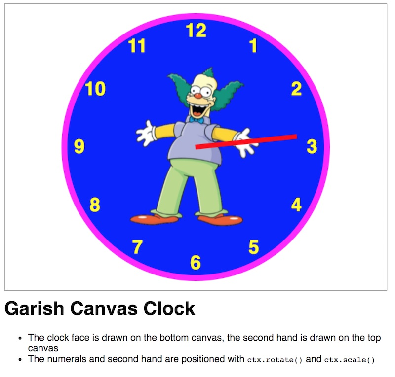

# Demo - Canvas Clock

- Can you use `ctx.translate()` and `ctx.rotate()` to draw the clock face, and animate the seconds hand?
  - Yes you can! Make it so!
- Note that we are drawing the clock face on the *bottom* canvas (`ctx1`), and the seconds hand on the *top* canvas (`ctx2`)

## Screenshot of Done Version


## Start Code

**second-hand-start.html**

```html
<!DOCTYPE html>
<html lang="en">
<head>
	<meta charset="utf-8" />
	<title>Clock! With Krusty!</title>
	<style type="text/css">
	#canvas1{
		position: absolute;
		border:1px solid red;
		z-index: 1; 
	}
	
	#canvas2{
		position: absolute;
		border:1px solid gray;
		z-index: 2; /* will be on top of #canvas1 */
	}
	
	div{
		position: absolute;
		top: 480px;
		font-family: sans-serif;
		width:640px;
	}
	</style>
	<body>
	<canvas id="canvas1" width="640" height="480">
		Get a real browser!
	</canvas>
	
	<canvas id="canvas2" width="640" height="480">
		Get a real browser!
	</canvas>
	<script>
		'use strict';
		
		const ctx1 = document.querySelector('#canvas1').getContext('2d');
		const ctx2 = document.querySelector('#canvas2').getContext('2d');
		const sWidth = 640, sHeight = 480, radius = 220, margin = 25;
	// 	const krustyImage = new Image();
// 		krustyImage.src = "https://upload.wikimedia.org/wikipedia/en/thumb/5/5a/Krustytheclown.png/220px-Krustytheclown.png";
// 		krustyImage.onload = _ => init(ctx1);
		
		init(ctx1);
		
		function init(ctx){
				ctx.fillStyle = 'blue'; 
				ctx.strokeStyle = 'magenta';
 				ctx.lineWidth = '10';
 				ctx.font = 'bold 32px Helvetica';
 				ctx.textAlign = 'center';
 				ctx.textBaseline = 'middle';
 				
				// draw BG
				// draw circle in center of screen with a radius of `radius`
				
				// draw Krusty
			//	ctx.drawImage(krustyImage,sWidth/2 - 220/2 ,sHeight/2 - 289/2);
				
				
				// draw Numerals
				ctx.fillStyle = 'yellow';
				
				// Hints
				// 1 - translate to center of screen
				// 2 - ctx.save(), and start looping from 1 to 12
				// 3 - rotate some amount
				// 4 - translate some amount
				// 5 - rotate the numeral properly
				// 6 - fill text
				// 7 - ctx.restore()
				
				
				update();	
		}
		
		function update(){
			requestAnimationFrame(update);
			drawSecondHand(ctx2);
		}
		
		function drawSecondHand(ctx){
			let seconds = new Date().getSeconds(); // returns 0-59
			// Hints
			// 1 - calc rotation amount based on seconds
			// 2 - translate to center of screen
			// 3 - rotate the proper amount
			// 4 - draw a line
			// 5 - don't forget to save and restore
		}
		

 		function cls(ctx){
 			ctx.clearRect(0,0,sWidth,sHeight);
 		}
		
	
	</script>
	<div>
	<h1>Garish Canvas Clock</h1>
	<ul>
		<li>The clock face is drawn on the bottom canvas, the second hand is drawn on the top canvas</li>
		<li>The numerals and seconds hand are positioned with <code>ctx.rotate()</code> and <code>ctx.translate()</code></li>
	</ul>
	</div>
</head>

</body>
</html>
```
