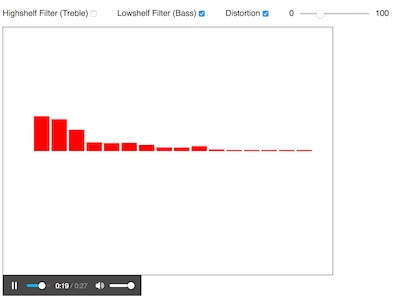

# Demo - More Web Audio

## I. Overview
Here we are going to build on top of what we built in [demo-web-audio-1.md](./demo-web-audio-1.md) by chaining multiple effect nodes:
- a checkbox to control the *treble* of the sound (a *highshelf* [BiquadFilterNode](https://developer.mozilla.org/en-US/docs/Web/API/BiquadFilterNode))
- a checkbox to control the *bass* of the sound (a *lowshelf* BiquadFilterNode)
- a checkbox and a slider to control the *distortion* of the sound (a [WaveShaperNode](https://developer.mozilla.org/en-US/docs/Web/API/WaveShaperNode) filter)
  - *waveshaping* is non-linear distortion, and can be likened to a distorting amplifier - some frequencies fed into the filter will be suppressed, others will be exagerated, and some new sound components not present in the original signal will be introduced
  - http://magic.hecanjog.com/Sounds/Words/CMJ-1979-Vol3-No2-June/3680281.pdf


## II. Start File

- the start file is the **web-audio-3.html** we built in [demo-web-audio-1.md](./demo-web-audio-1.md)


## III. Done Version

- The enhanced version we will build today will have 3 checkboxes and a slider



## IV. HTML & CSS
 - go ahead and rename **web-audio-3.html** to **web-audio-4.html**
 - add this CSS to the file:
```css
*{font-family:sans-serif;}
span{margin-right:2em;}
#distortionSlider{position:relative;top:.7em;}
```

- here's your HTML - it goes right before the &lt;canvas> tag:

```html
<p>
  <span><label for="highshelfCB">Highshelf Filter (Treble)</label><input type="checkbox" id="highshelfCB"></span>
  <span><label for="lowshelfCB">Lowshelf Filter (Bass)</label><input type="checkbox" id="lowshelfCB"></span>
  <span><label for="distortionCB">Distortion</label><input type="checkbox" id="distortionCB"></span>
  <span>0 <input type="range" min="0" max="100" value="0" id="distortionSlider"> 100</span>
</p>
```

- reload the page, it should now look like the "done" version. You are welcome.

## V. Modifying the highshelf filter (Treble)

- A highshelf filter boosts (or attenuates) the gain of frequencies that are higher than the `.frequency` property. Lower frequencies are ignored. We build this filter last time, but not in such a way that we could easily turn it on or off

1. before you do anything else, wrap the code in an IIFE to get our variables and fucntions out of the global scope, and then make sure the code still works.

2. Add the following JS function to your file:

```js
function setupUI(){
  document.querySelector('#highshelfCB').checked = highshelf;
  document.querySelector('#highshelfCB').onchange = e => {
    highshelf = e.target.checked;
    toggleHighshelf();
  };
  toggleHighshelf();
}
```
3. Now call `setupUI()` right before your canvas setup code

4. You are going to need to declare `highshelf` as a variable that is scoped outside of `setupUI()`. Give it an initial value of `false`. Declare it right after the web audio setup code.

5. now here's `toggleHighshelf()` - which will get called every time the checkbox gets checked or unchecked:

```js
function toggleHighshelf(){
  if(highshelf){
    biquadFilter.frequency.setValueAtTime(1000, audioCtx.currentTime);
    biquadFilter.gain.setValueAtTime(25, audioCtx.currentTime);
  }else{
    biquadFilter.gain.setValueAtTime(0, audioCtx.currentTime);
  }
}
```

6. Lastly, delete the 2 lines of code from the old version that set the frequency and gain of the `biquadFilter` right adter it was first instantiated.

7. Test your code to be sure that the first checkbox toggles the highshelf (treble) filter on and off


## VI. Creating the lowshelf filter (Bass)
- With a lowshelf filter, frequencies lower than the `.frequency` get a boost, or an attenuation; higher frequencies are ignored.

1. Here's the `toggleLowshelf()` function:

```js
function toggleLowshelf(){
  if(lowshelf){
    lowShelfBiquadFilter.frequency.setValueAtTime(1000, audioCtx.currentTime);
    lowShelfBiquadFilter.gain.setValueAtTime(15, audioCtx.currentTime);
  }else{
    lowShelfBiquadFilter.gain.setValueAtTime(0, audioCtx.currentTime);
  }
}
```

2. You should be able to do the rest: set up a `lowshelf` boolean, set up the `lowShelfBiquadFilter` audio node, set up the event listeners for the checkbox in `setupUI()`, etc

3. Test your code to be sure that the second checkbox toggles the lowshelf (bass) filter on and off


## VII. Creating the waveshaper filter (Distortion)


1. First, you need to add these functions to your file

```js
function toggleDistortion(){
  if(distortion){
    distortionFilter.curve = makeDistortionCurve(distortionAmount);
  }else{
    distortionFilter.curve = null;
  }
}

// from: https://developer.mozilla.org/en-US/docs/Web/API/WaveShaperNode
function makeDistortionCurve(amount=20) {
  let n_samples = 256, curve = new Float32Array(n_samples);
  for (let i =0 ; i < n_samples; ++i ) {
    let x = i * 2 / n_samples - 1;
    curve[i] = (Math.PI + amount) * x / (Math.PI + amount * Math.abs(x));
  }
  return curve;
}
```
