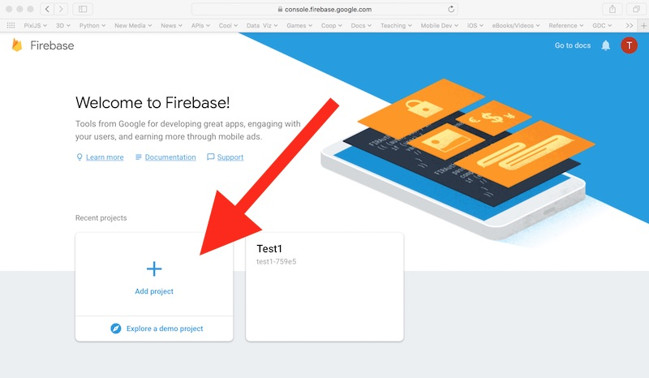
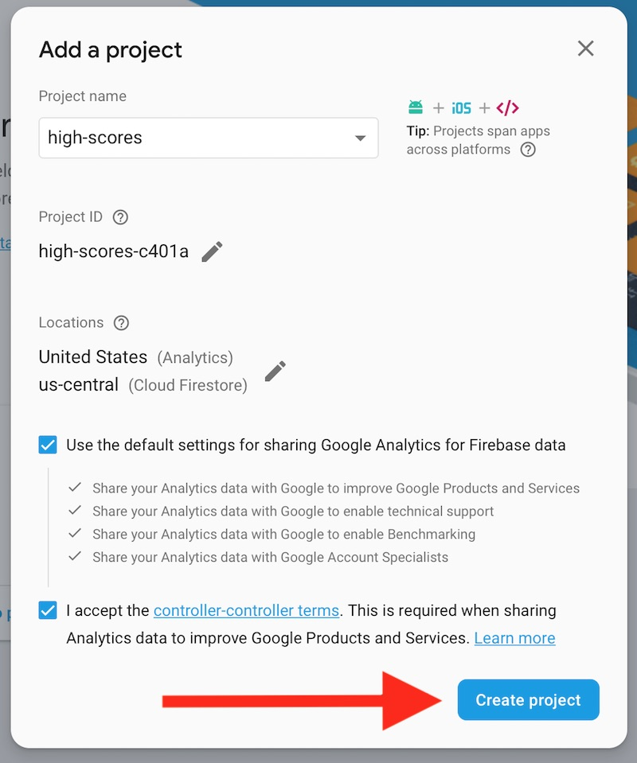
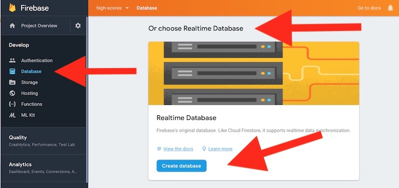

# 1 - Intro to Firebase 

- Here we will look at setting up a Firebase *Realtime Database*

## I. Overview
- About Firebase
- https://console.firebase.google.com


## II. Setting up a *Realtime Database*

### II-A. Create a new project

- Head to https://console.firebase.google.com/ and click the *Add Project* button, this will create a pop-up window where you will name your project



<hr>

### II-B. Name the project

- Name the project **high-scores** and click the **Create Project** button



<hr>

### II-C. Add a *Firebase for Web* App to your project

- You should now be on the **Project Overview** screen
- Click on the *Firebase for Web* button on the right, which creates a pop-up window
- This creates a new web app for this project. Note that there are other options for creating Android and iOS Apps. The idea here is that the project will have one set of data, and you could have multiple apps (web, Android, iOS) that SHARE this data


<hr>

### II-D. Copy the code snippet

- A pop-up window will appear that contains the JavaScript set-up code you will need to enable Firebase on a web page
- Go ahead and create an HTML file named **firebase-test.html** and copy/paste this JS code into the &lt;head> section of the document
- **Note:** If you need to get this setup code at a later time, go to **Develop > Authentication** in the [Firebase console](https://console.firebase.google.com), select the project, then click **Web Setup**


<hr>

### II-E. Create a Realtime Database

- After you have copied the code, close the pop-up window
- To change to the *Database* screen, click on the **Database** tab on the left 
- Then scroll down the page, and stop at the **Or choose Realtime Database** heading
- Click the **Create Database** button, which will open a pop-up window



<hr>

### II-F. Set the security rules for your database

- Choose **Start in test mode**
- Click the **Enable** Button
- You can modify these rules later under the "Rules" tab


<hr>

### II-G. Verify

- You should now have created an empty *Realtime Database*


<hr>

### II-H. Test your Realtime Database
- We need to write code in **firebase-test.html** to write some values to your database
- To test your database, add the following to the &lt;script> tag, right after the code that you previously copy/pasted:

```js
  console.log(firebase); // verify that firebase is loaded
  
  // #1 - get a reference to the databse
  let database = firebase.database();
  
  // #2 - refer to a root node named `scores`
  let ref = database.ref('scores');
 
 // #3 - create some data
  let data = {
  	name:"Mad Max",
  	score:99999
  };
  
  // #4 - send data!
  ref.push(data);
```

<hr>

### II-I. See the changes!

- Head back to your high-scores database, you should see the high score has been posted to "the cloud" - oooh!
- If you reload your HTML page, the data will be posted multiple times, each time with a unique UUID


<hr>

## III. Documentation and Examples

- Get Started with Firebase for Web Apps --> https://firebase.google.com/docs/web/setup?authuser=0
- Firebase Web SDK API Reference --> https://firebase.google.com/docs/reference/js/index-all?authuser=0
- Firebase Web Samples --> https://firebase.google.com/docs/samples/?authuser=0#web

<hr><hr>

**[Next Chapter -> Firebase Part II - High Score App](firebase-2.md)**
