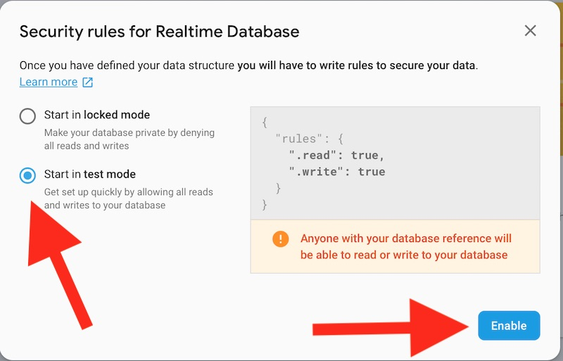
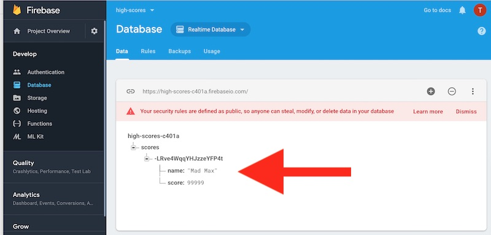

# 1 - Intro to Firebase 

- Here we will look at setting up a Firebase *Realtime Database*

## I. Overview
- About Firebase
- https://console.firebase.google.com


## II. Setting up a *Realtime Database*


### II-A. Create a new project

- Head to https://console.firebase.google.com/ and click the *Add Project* button


### II-B. Name the project

- Name the project **high-scores** and click the **Create Project** button


### II-C. Add *Firebase for Web* to your project

- You should now be on the **Project Overview** screen
- Click on the *Firebase for Web* button on the right


### II-D. Copy the code snippet

- A pop-up window will appear that contains the JavaScript set-up code you will need to enable Firebase on a web page
- Go ahead and create an HTML file named **firebase-test.html** and copy/paste this code into the &lt;head> section of the document


### II-E. Create a Realtime Database

- After you have copied the code, close the pop-up window
- To change to the Databse screen, click on the **Database** tab on the left 
- Then scroll down the page, and stop at the **Or choose Realtime Database** heading
- Click the **Create Database** button


### II-F. Set the security rules for your database

- Choose **Start in test mode**
- Click the **Enable** Button
- You can modify these rules later under the "Rules" tab




### II-G. Verify

- You should now have create an empty Realtime Databse


### II-H. Test your Realtime Database
- Write code in **firebase-test.html** to write some values to your database
- add the following to the &lt;script> tag, right after the code that you previously copy/pasted:

```js
  console.log(firebase); // verify that firebase is loaded
  
  // #1 - get a reference to the databse
  let database = firebase.database();
  
  // #2 - refer to a root node named `scores`
  let ref = database.ref('scores');
 
 // #3 - create some data
  let data = {
  	name:"Mad Max",
  	score:99999
  };
  
  // #4 - send data!
  ref.push(data);
```

### II-I. See the changes!

- Head back to your high-scores database, you should see the high score has been posted
- If you reload your HTML, the data will be posted multiple times, each time with a unique UUID




## III. Wrap up


