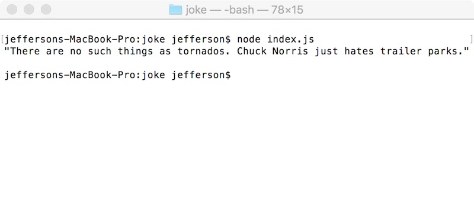

# Node.js and Web Services - 1

## Overview

- By this point you have seen how we can access JSON web services from the web browser using JavaScript:
  - [Web Apps Part 10 - Web Services](https://github.com/tonethar/IGME-230-Master/blob/master/notes/web-apps-10.md)
  - [Homework: GIF Finder](https://github.com/tonethar/IGME-230-Master/blob/master/notes/HW-gif-finder.md)
  - [Web Service App - Examples & Starters](https://github.com/tonethar/IGME-230-Master/blob/master/notes/web-service-app-starters.md)
- We can also download web pages and services from the **command line** using [Node.js](https://nodejs.org/en/) - below we will work through a few examples, giving us more of a chance to work with both web services and Node.js
- We will also see how we can create symbolic links and easily run these programs as command line tools

## Contents

<!--- Local Navigation --->
I. [Install Node.js and npm (if you need to)](#section1)

II. [Downloading and displaying a simple "text" web service](#section2)

III. [Next Steps](#section3)

<a id="section1"></a>

## I. Install Node.js and npm (if you need to) 

- **Node.js** is a command-line JavaScript runtime built on Chrome's V8 JavaScript engine. Node.js uses an event-driven, non-blocking I/O model that makes it lightweight and efficient. Node.js' package ecosystem, **npm**, is the largest ecosystem of open source libraries in the world.
  - https://nodejs.org/en/
- **npm** is the package (i.e. "library") manager for JavaScript
  - https://www.npmjs.com
  
To see if you already have node and npm installed on your computer, type the following in the console:

```js
node -v
npm -v
```
  
### A) How to install Node.js and the Node Package Manager (npm)
 
- ***Important Note: Mac OS users will often be required to have `sudo` typed at the beginning of any commands whenever they are installing applications or packages.***
 
- You could install Node.js with **nvm** (the *Node Version Manager*) like this:
 
 ```js
 curl -o- https://raw.githubusercontent.com/creationix/nvm/v0.33.0/install.sh | bash
 ```
 
 - and then: 
 
 ```js
 nvm install node
 node -v
 npm install npm@latest -g
 npm -v
 ```
 
 **OR**
 
 - You can head to https://nodejs.org/en/download/ and grab an installer - instructions are here:
 
 https://docs.npmjs.com/getting-started/installing-node
 
 
### B) Test that node and npm are installed
 
 - When **Node.js** is installed, it also installs **npm** (*Node Package Manager*). Head to the command prompt to verify that npm is installed by typing:
 
 ```js
 node -v
 npm -v
 ```
 
 - After that, you can run the updater on npm itself by typing (Mac users will need `sudo` again):
 
 ```js
 npm install npm@latest -g
 ```
 
 - ***At this point you should be ready to go!***
 
<a id="section2"></a>
  
## II. Downloading and displaying a simple "text" web service

- We are going to keep this as bare-bones as possible (not even using `npm`), so we will just download a joke from a "random Chuck Norris joke" web service. The web service will return the joke data in plain text format - here are the docs:
  - https://github.com/sameerkumar18/geek-joke-api
- and here is the URL to the service:
  - https://geek-jokes.sameerkumar.website/api

If you test this in a browser, you will see a random plain-text joke such as `"E-mail returned to sender... insufficient voltage."`


### A. Get started:
  - create a folder named **joke**
  - inside of the **joke** folder, create a file named **index.js**
  
### B. Add the following to **index.js**:

```js
// #1 - import the request module, which is used to download data over http
const request = require('request');

// #2 - set the value of the `options` object, which contains configuration data,
// including the URL we are interested in downloading
// https://nodejs.org/docs/latest-v9.x/api/http.html#http_http_request_options_callback
const options = {
    url: 'https://geek-jokes.sameerkumar.website/api',
    method: 'GET'
}

// #3 - make the request
// the second parameter below is a callback function (an ES6 arrow function in this case)
// which is called when the data is downloaded
request(options, (err, response, body) => {
    // if there's no error, and if the server's status code is 200 (i.e. "Ok")
    if(!err && response.statusCode == 200){
    	// log out the plain-text joke - no parsing required!
        console.log(body);
    }
});
```
  
### C. Open your console, and change directory to the **joke** folder. Run the app by typing:

```js
node index.js
```

### D. FAILURE!

- You should see a series of error messages that begin with **`Error: Cannot find module 'request'`** 
- This is happening because you never downloaded the files that node needs to actually import the **request** module code.

### E. Download the **request** module files by typing this (Mac users will need `sudo` again):

```js
npm install request
```

- Downloading of files now should begin. Once downloading has completed, you will see a few warnings about a file named **package.json** missing - we will address this in the next section.
- You should now see a folder named **node_modules** - open it up and you will that that there are approximately 50 sub-folders, including one named **request**. These additional folders are all of the modules that the **request module** is dependent on.
- You will see one more file - **package-lock.json**  - this file keeps track of all of the project modules and dependencies - you won't need to worry about for our examples - but if you wish you can read about it here: https://docs.npmjs.com/files/package-lock.json

### F. Try to run the app again by typing:

```js
node index.js
```

**SUCCESS! - You should see a joke in the console - something like:**

```
"The First rule of Chuck Norris is: you do not talk about Chuck Norris."
```




<a id="section3"></a>
## III. Next Steps

- There isn't too much more to do with this example right now, but once you have finished this series, come back to this example and:
  - use `npm init -y` to create a **package.json** file
  - using the instructions here as a guide, make this script an executable command named `get-joke`: https://medium.com/netscape/a-guide-to-create-a-nodejs-command-line-package-c2166ad0452e


<hr><hr>

**[Next Chapter -> Node.js and Web Services (chapter 2)](node-and-web-services-2.md)**

