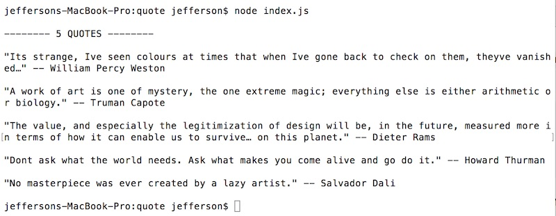
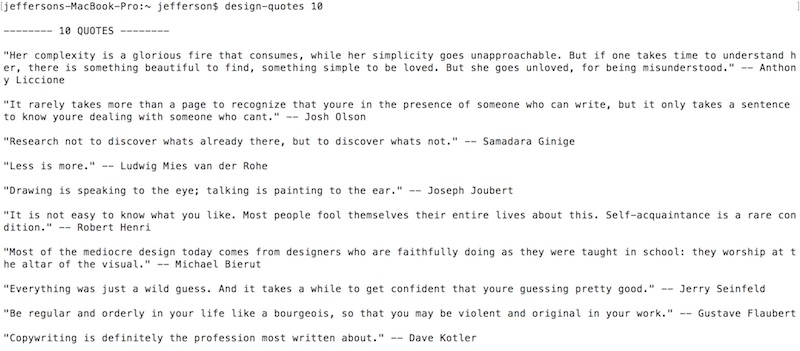

# Node.js and Web Services - 2

## Overview

This time we are going to look at how to download a different web service, in this case an "inspirational design quote" service. Although this sounds really similar to what we did last time, there are differences that will make this more challenging:
- we are going to create a **package.json** file this time
- the data is in the JSON format so we will need to parse it before displaying it
- the web service takes parameters, such as the number of results:
  - this means we will need to format the URL differently
  - we will need to loop through the results
  - we will need to give the user of this script the ability to choose how many results they want (i.e. pass arguments to the web service)

## Contents

<!--- Local Navigation --->
I. [Preview our new web service](#section1)

II. [Working with the package.json file](#section2)

III. [Utilize the "inspirational design quotes" service](#section3)

IV. [Turning our script into a command line tool](#section4)

V. [Homework](#section5)

<hr>

<a id="section1"></a>

## I. Preview our new web service
- The documentation of this web service is here: https://quotesondesign.com/api-v4-0/
- An API key is not required to use this web service
- To see the web service in action, bring up a new window in Chrome and open this URL:

```
http://quotesondesign.com/wp-json/posts?filter[orderby]=rand&filter[posts_per_page]=1
```

- which gives you 1 random inspirational quote, in an array, that looks like this:


- as you can see above, we are probably most interested in the `.title` and `.content` properties
- one wrinkle is that the content has HTML in it - which we are going to need to strip out for this command line application
- If your JSON isn't as nicely formatted as mine, it's because I am using the Chrome JSON Viewer extension which you can get here: https://chrome.google.com/webstore/detail/json-viewer/gbmdgpbipfallnflgajpaliibnhdgobh

<a id="section2"></a>

## II. Working with the package.json file

### A. Get started:

- create a new folder named **quote**
- copy over your completed **index.js** file from Node.js and Web Services - Part I


### B. Create a node project the usual way
- this time we are going to follow the usual practice and create a node project with **npm** - go ahead and change directory to the **quote** folder and type:

```js
npm init -y
```

This will create your **package.json** file with the default metadata about your project, which is stored in an object literal, and will look something like this:

```js
{
  "name": "quote",
  "version": "1.0.0",
  "description": "",
  "main": "index.js",
  "scripts": {
    "test": "echo \"Error: no test specified\" && exit 1"
  },
  "keywords": [],
  "author": "",
  "license": "ISC"
}
```

### C. Download the **request** module 

This time, we are going to download the **request** module, and then *save this dependency* into the **package.json** file. Type the following in (Mac users will need `sudo` again):

```js
npm install request --save
```

- This will download and install the **request** module and other dependencies to the **node_modules** folder just like last time
- The `--save` flag is what tells npm to add a `"dependencies":` key to **package.json**, which you can see if you open the file:

```js
"dependencies": {
    "request": "^2.88.0"
  }
```

- note that we didn't get the warnings about the missing **package.json** file like we did last time

### D. Test the script

- Run the script to be sure that it still works as before:

```js
node init.js
```
 
 - Which should print out another Chuck Norris joke such as:
 
 ```
"Chuck Norris can do a roundhouse kick faster than the speed of light. This means that if you turn on a light switch, you will be dead before the lightbulb turns on."
 ```
 
### E. Test package.json

- delete your **node_modules** folder
- if you run your script again - `node init.js` - it fails! - because the **request** module is nowhere to be found
- to re-install the **request** module files - just type `npm install` - which will re-download the **request** module and its dependencies because it is listed in the `"dependencies":` key of **package.json**
- run your script again - `node init.js` - it succeeds!

<a id="section3"></a>

## III. Utilize the "inspirational design quotes" service

Now that we have our script and **package.json** file working with the "random chuck norris joke" web service, it's time to get it working with our new "inspirational design quotes" web service.

### A. Modify the code to request a variable number of results

Change section #2 of **index.js** so it looks like this: 

```js
// #2 - set our URL
let url = "http://quotesondesign.com/wp-json/posts?filter[orderby]=rand&filter[posts_per_page]=";
let numResults = 1; // let's make 1 quote the default, but we'll let the user change it later
url += numResults; // concatenate `numResults` to the end of the query string
```


### B. Convert the downloaded text to a parsable object

- The "Chuck Norris joke" web service returned plain text, but this one returns the data as a JSON string
- We need to convert this string to an object before we can parse it - `JSON.parse()` accomplishes this for us
- **Note:** in the web browser, we have been using `jQuery.ajax()` to download the data, and jQuery has been automagically converting the downloaded string to a JSON object for us - wasn't that nice of it?)
- Go ahead and change section #3 of **index.js** so it looks like this: 

```js
// #3 - make the request
// the second parameter below is a callback function (an ES6 arrow function in this case)
// which is called when the data is downloaded
request(url, (err, response, body) => {
    // if there's no error, and if the server's status code is 200 (i.e. "Ok")
    if(!err && response.statusCode == 200){
    	// A - convert the downloaded text to a JavaScript Object (in this case an array)
        let obj = JSON.parse(body); 
        // B - grab the first result
        let result = obj[0];
        // C - grab the `.content` property of the first result
        let text = result.content;
        // D - log it out
        console.log(text);
      }
});
```

### C. Test the code

- Go ahead and type `node index.js` to run the code - it should successfully download the text, convert it to JSON, parse out the content, and log it to the console. You should see something like this:

```
<p>Stop looking at yourself as a designer, and start thinking of yourself as a deliverer of ideas.</p>
```

This is working great, except for those HTML tags that we don't need to see. Let's fix that next

### D. Stripping HTML tags

- Here's a helper function you can add to **index.js**:

```js
// https://stackoverflow.com/questions/5002111/how-to-strip-html-tags-from-string-in-javascript
function stripTags(str){
   return str.replace(/<\/?[^>]+(>|$)/g, "");
}
```


- Now call this function in your code in the proper place to get rid of the HTML tags
- ***Test it!*** The HTML tags are gone, although you will still see HTML entities occasionally (mostly for punctuation) - we will let you fix that issue on your own

<a id="section4"></a>

## IV. Turning our script into a command line tool

Things we are going to do in this section:
- Display the author name (the `.title` is this case)
- Display multiple quotes
- Parse the first command line argument, and only show that number of quotes
- Make **index.js** a command line script (tool) named **design-quotes** that we can run from anywhere just by typing `design-quotes`

### A. Display the Author's name
- ***Write the code to do this!***

### B. Display mulitiple quotes
- ***Write a `for` loop and do this!***

<hr>

***Here's what mine looks like - I added a little formatting, and wrote code to strip out the HTML entities:***



<hr>

### C. Parse the first command line argument, and only show that number of quotes

- Here's a great article walking through how to do this - https://medium.com/netscape/a-guide-to-create-a-nodejs-command-line-package-c2166ad0452e - but we'll give you specific instructions below

#### i. Add the Shebang line to the top of index.js

```
#!/usr/bin/env node
```

- This is the path to the node executable that will parse and run the code in the **index.js** file
- [Wikipedia - Shebang](https://en.wikipedia.org/wiki/Shebang_%28Unix%29)

#### ii. Parse out the first command line argument

Replace the `numResults` line with this:

```js
let numResults = process.argv[2] || 1; // 1 will be the default
```

- `process.argv` is an array of the command line arguments the user typed - the third element in this array is the first argument that is passed *after* the name of the script. Read about this here:  https://nodejs.org/api/process.html#process_process_argv

#### iii. Test the script

- type `node index.js` and you should see 1 result (the default)
- type `node index.js 10` and you should see 10 results
- and so on ...

### D. Make the script an executable tool (and not have to type `node` first)

- make **index.js** executable by typing (in Unix land) `chmod +x index.js`

- test **index.js** by typing `./index.js 10` - which should give you 10 results

- now make **index.js** globally executable by adding the following key to **package.json**:

```js
"bin":{
  	"design-quotes": "./index.js"
  }
```
- `"design-quotes"` is now the name of the command
- create the link by typing `npm link` on the command line (Mac users will need `sudo` at the beginning again)

***Test it! Type `design-quotes 10` from any directory - now the script should run from anywhere!***

***Here is my example:***



<a id="section5"></a>

## V. Homework
Out of 10 points.
- Make sure that everything we asked for in Section IV. is working:
  - Display the author name (1 point)
  - Display multiple quotes (4 points)
  - Parse the first command line argument, and only show that number of quotes (2 points)
  - Make **index.js** a command line script (tool) named **design-quotes** that we can run from anywhere just by typing `design-quotes` (2 points)
- Also be sure that everything is formatted nicely - add spacing where appropriate - and recall that `\n` in a string is the new line character (1 point)

**ZIP and POST to Dropbox**
<hr><hr>

**[Previous Chapter <- Node.js and Web Services (chapter 1)](node-and-web-services-1.md)**

